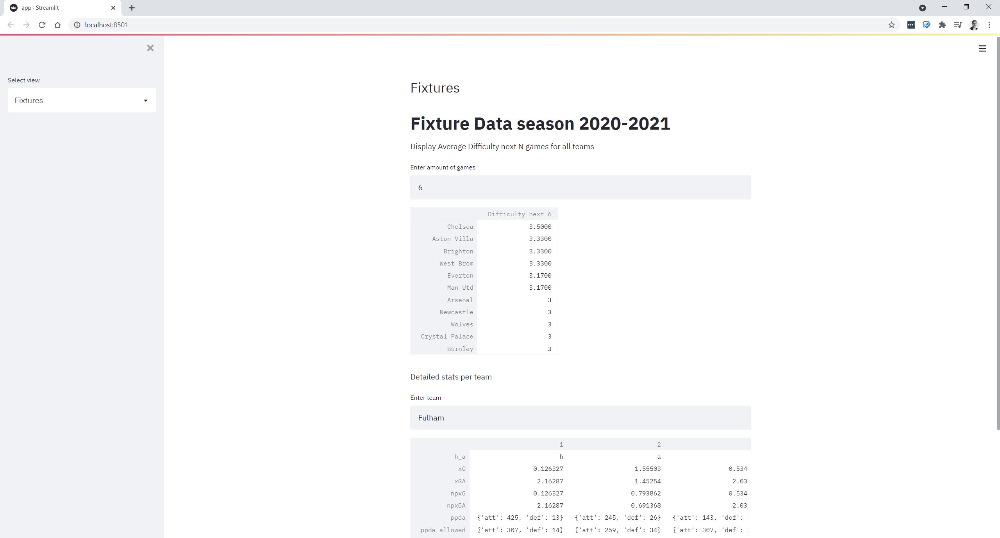
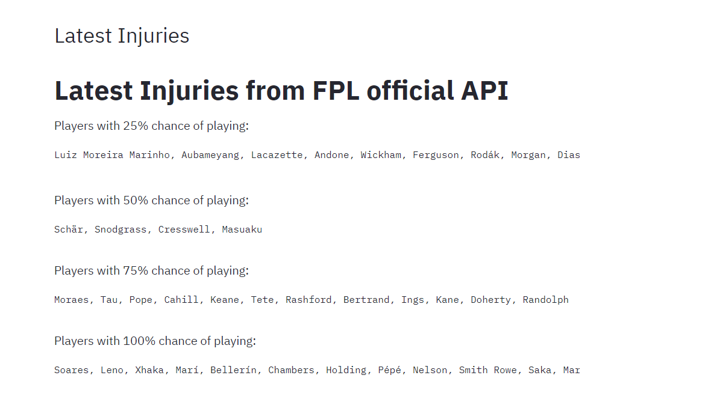
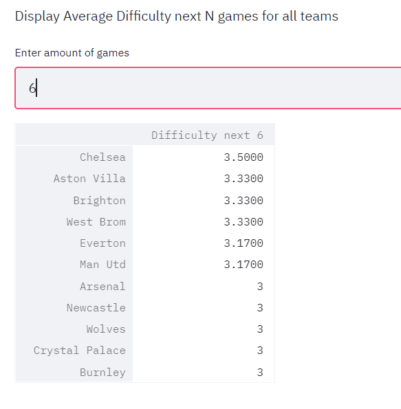

# fpl-analytics: FPL Analytics App with Streamlit

Analyze fixture data and results per round on player and team level. 

Fixture data is fetched with the help from @vaastav: https://github.com/vaastav/Fantasy-Premier-League

Injury stats is collected via API directly into the App memory. 

Some images:

